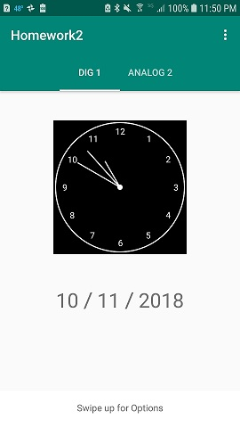
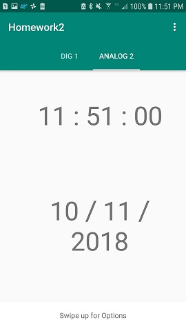
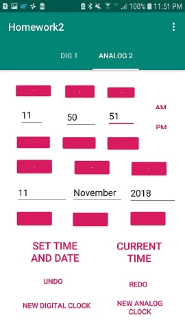
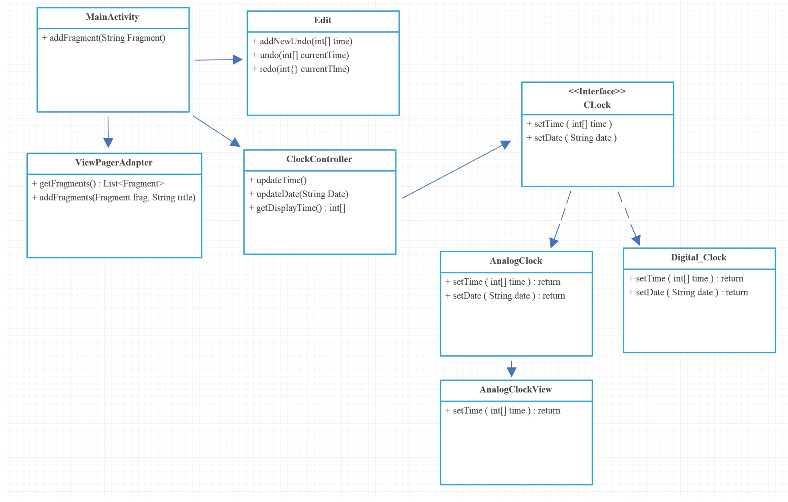

#CEG-4110-HW2

Homework 2
---
This applicaiton allows a user to view time in two different ways. An analog clock and a digital clock.
The user may choose to set the current time or date as they see fit.  They may also undo and or redo
any previoius time changes.

Deployment Instructions
---
In the homework2 folder you will navigate to the following directory and find the executable apk
Homework2\app\build\outputs\apk\debug\app-debug-apk

Instructions
---
Below are three images showing the three possible views for this application.  The first image shows off
the analog clock followed by the digital clock, and options menu.  On boot the app will have a preset of
an analog clock and digital clock already created.  On either page the user may swipe up on the bottom tab
to access the options menu.  Inside the options meny the user may click the + or - buttons to set a custom
time of their choosing.  Below this the user may also switch between the current time and their custom
time.  The undo and redo buttons allow for undoing and redoing previous time changes.  Lastly, their is a
new digital clock and new analog clock button.  This functionality will dynamically create as many tabs
as the user would like containing multiple different clocks all displaying the same time.

Design
---
This project implements the MVC design pattern.  This pattern is made possible with 4 main classes and
1 interface.  MianActivity, ClockController, Digital_Clock, and Analog_Clock are the 4 classes used and
Clock is an interace.

MainActivity represents the intial and only activity for this project.  it contains the tab layout for
the clocks and the swipeUpOptions menu.

ClockController is the brain of the clocks as it does all the work related to keeping the current applications
time and date.  It contains one thread that repeats every second, getting the new time.  This time is then
pushed to the Views throught the interface to update the screen.  It also keeps track of if the current time
or user set time should be displayed.

Clock is an interface that contains two abstract functions, setTime and setDate.  This allows the
clockController to simply update the time on clock objects instead of juggling between Digital_Clock and
Analog_Clock.

Digital_Clock and Ananlog_Clock are two view classes whos sole purpose is to update the view to the user of
the current time and date. They both implement setTime and setDate.

